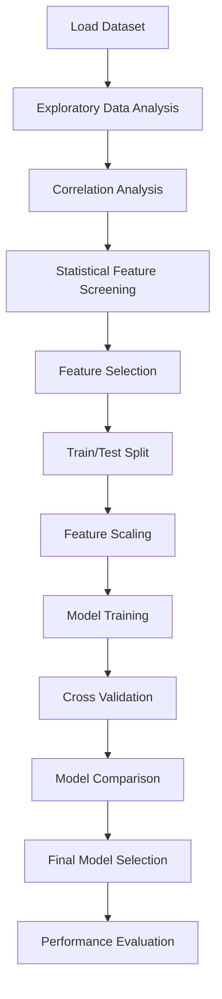

# Customer Happiness Prediction

Predicting **customer happiness** using machine learning models trained on survey responses related to delivery experience, pricing, product expectations, and app usability.

This project demonstrates a **complete applied ML workflow**: from exploratory data analysis and statistical validation to feature selection, model comparison, and final evaluation.

---

# Project Overview

Customer experience is a critical business metric. Understanding the drivers of satisfaction helps companies improve retention, increase repeat purchases, and identify operational bottlenecks.

This project builds a **binary classification model** to predict whether a customer is **happy or unhappy** based on their responses to six operational survey questions.

The notebook walks through:

* Exploratory data analysis
* Statistical feature analysis
* Feature selection
* Model benchmarking
* Cross-validation
* Final model evaluation

The goal was to **achieve ≥73% prediction accuracy**, which was successfully met.

---

# Problem Statement

Companies often collect survey feedback but struggle to translate it into **predictive insight**.

This project answers the question:

> Can we predict customer happiness using only operational survey responses?

Solving this allows organizations to:

* identify dissatisfaction drivers early
* improve delivery and operational processes
* prioritize product improvements
* detect at-risk customers

---

# Dataset Description

The dataset consists of **126 survey responses**.

### Target Variable

| Variable | Description                                 |
| -------- | ------------------------------------------- |
| Y        | Customer happiness (0 = unhappy, 1 = happy) |

### Input Features

All features are scored **1–5**, where higher values indicate stronger agreement.

| Feature | Description                                   |
| ------- | --------------------------------------------- |
| X1      | Order delivered on time                       |
| X2      | Order contents met expectations               |
| X3      | Customer was able to order everything desired |
| X4      | Customer paid a fair price                    |
| X5      | Satisfaction with courier                     |
| X6      | App usability                                 |

---

# Project Workflow



---

# Exploratory Data Analysis

Key observations:

* Dataset contains **126 records**
* No missing values
* All survey variables fall within the expected **1-5 range**
* Target distribution is reasonably balanced

Initial analysis focused on understanding:

* feature distributions
* relationships with the target variable
* potential statistical significance

---

# Statistical Feature Analysis

Both **Pearson** and **Spearman** correlations were used to examine relationships between survey variables and customer happiness.

Why Spearman?

Customer satisfaction signals often follow **monotonic but non-linear relationships**, making Spearman correlation a better indicator.

### Strongest predictors

* **On-time delivery (X1)**
* **Courier satisfaction (X5)**

### Weakest predictors

* **Order expectations (X2)**
* **Price perception (X4)**

This analysis guided the **feature selection step**.

---

# Feature Selection

Based on correlation analysis and statistical significance, the following variables were retained:

* **X1** – delivery timeliness
* **X3** – order completeness
* **X5** – courier satisfaction
* **X6** – app usability

Reducing dimensionality improves signal quality and reduces noise.

---

# Modeling Strategy

Multiple algorithms were evaluated to ensure robust model selection.

Models tested:

* Logistic Regression
* K-Nearest Neighbors (KNN)
* Gradient Boosting
* XGBoost
* Random Forest

A **5-fold Stratified Cross Validation** approach was used to obtain reliable performance estimates.

---

# Results

### Test Accuracy

| Model               | Accuracy   |
| ------------------- | ---------- |
| Logistic Regression | 61.54%     |
| KNN                 | **73.08%** |
| Gradient Boosting   | 65.38%     |
| XGBoost             | 65.38%     |
| Random Forest       | 65.38%     |

### Best Model

**K-Nearest Neighbors (KNN)** achieved the best performance.

Why KNN worked well:

* small dataset size
* low dimensional feature space
* non-linear relationships between features and target

Final accuracy: **73.08%**

This meets the project target.

---

# Key Insights

### Delivery experience drives happiness

Operational reliability appears more important than pricing perception.

### Customer happiness is non-linear

The performance difference between Logistic Regression and KNN indicates that satisfaction signals behave non-linearly.

### Simpler models can outperform complex ones

For smaller datasets, simple algorithms may generalize better.

### Feature selection improves interpretability

Reducing variables clarified which operational factors matter most.

---

# Repository Structure

```
Customer-Happiness-Prediction
│
├── happy_customers.ipynb
│
├── requirements.txt
│
├── README.md
│
└── dataset
    └── input_data.csv (paste your file here)
```

---

# Installation

Clone the repository

```bash
git clone https://github.com/ninad22dixit/4jZwyXDToThs9ZSf.git
cd 4jZwyXDToThs9ZSf
```

Create virtual environment

```bash
python -m venv venv
```

Activate environment

Windows

```bash
venv\Scripts\activate
```

Mac / Linux

```bash
source venv/bin/activate
```

Install dependencies

```bash
pip install -r requirements.txt
```

Run the notebook

```bash
jupyter notebook
```

---

# Skills Demonstrated

This project demonstrates practical capabilities in:

* Exploratory Data Analysis
* Statistical Feature Testing
* Machine Learning Model Selection
* Cross Validation Techniques
* Feature Engineering
* Model Evaluation
* Python Data Science Stack

Tools used:

* Python
* Pandas
* NumPy
* SciPy
* scikit-learn
* XGBoost
* Matplotlib / Seaborn

---

# Future Improvements

Potential extensions include:

* hyperparameter optimization
* ROC-AUC and PR curve analysis
* SHAP explainability
* production pipeline using sklearn pipelines
* deployment as a lightweight prediction API

---

# Concluding Remarks

This project reflects a **realistic applied machine learning workflow**, including:

* problem framing from a business perspective
* rigorous exploratory analysis
* statistical validation of features
* thoughtful model comparison
* clear interpretation of results

The focus was not just on achieving accuracy but on **understanding the drivers of customer satisfaction and building interpretable predictive models.**

---

# Author

**Ninad Dixit**

Machine Learning | Data Science | Applied AI

GitHub:
[https://github.com/ninad22dixit](https://github.com/ninad22dixit)

---
